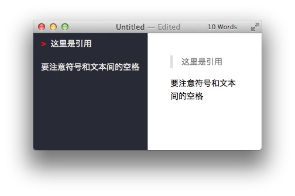
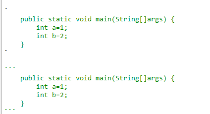

# 一、标题(#)
##
### n个‘#’+空格+标题内容
- ‘# 一级标题内容’
- ‘## 二级标题内容’
- ‘### 三级标题内容’
- ‘#### 四级标题内容’
- ‘##### 五级标题内容’
- ‘###### 六级标题内容’


***
---

# 二、分隔符(#/*/-)
##
- 粗线分隔符：1.三个‘-’，即‘---’；2.三个‘*’，即 ‘***’
- 细线分隔符：两个‘#’，即‘##’

---
---

# 三、图片与链接(/[]())
##
- 图片


- 链接
[链接到百度](http://baidu.com)

---
---

# 四、别处引用 (>)
##

- ‘> 这里是引用内容’
> 这里是引用内容



---
---

# 五、粗体与斜体
##
- 粗体：两个*夹内容   
> **此为粗体**

- 斜体：一个*夹内容
> *此为斜体*

- 倾斜并加粗
> ***此为倾斜并加粗***

---
---

# 六、列表
##
- 有序列表
> ‘-+空格+内容’

- 无序列表
> 1+空格+内容

---
---

# 七、表格
##

|姓名|性别|年龄|
|:----:|----:|:----|
|张三|男|22|
|李四|男|23|
|阿萨飒飒的撒|不男不女|456465465465|

- **markdown2使用表格需要使用extra版本：**
- *tool—options—markdown*
> 邮箱：Soar360@live.com
> 
> 授权秘钥：
> GBPduHjWfJU1mZqcPM3BikjYKF6xKhlKIys3i1MU2eJHqWGImDHzWdD6xhMNLGVpbP2
M5SN6bnxn2kSE8qHqNY5QaaRxmO3YSMHxlv2EYpjdwLcPwfeTG7kUdnhKE0vVy4RidP6
Y2wZ0q74f47fzsZo45JE2hfQBFi2O9Jldjp1mW8HUpTtLA2a5/sQytXJUQl/QKO0jUQY4pa5C
Cx20sV1ClOTZtAGngSOJtIOFXK599sBr5aIEFyH0K7H4BoNMiiDMnxt1rD8Vb/ikJdhGMMQr
0R4B+L3nWU97eaVPTRKfWGDE8/eAgKzpGwrQQoDh+nzX1xoVQ8NAuH+s4UcSeQ==

---
---

# 八、代码段
##
- 代码段用‘``’



`
	public static void main(String[]args) {
		int a=1;
		int b=2;
	}
`

```
	public static void main(String[]args) {
		int a=1;
		int b=2;
	}
```

---
---
# 九、markdown2快捷键使用
##
- 加粗 Ctrl+B
- 斜体 Ctrl+I
- 引用 Ctrl+Q
- 插入链接 Ctrl+L
- 插入代码 Ctrl+K
- 插入图片 Ctrl+G
- 提升标题 Ctrl+H
- 无序列表 Ctrl+U
- 横线 Ctrl+R
- 撤销 Ctrl+Z
- 重做 Ctrl+Y


