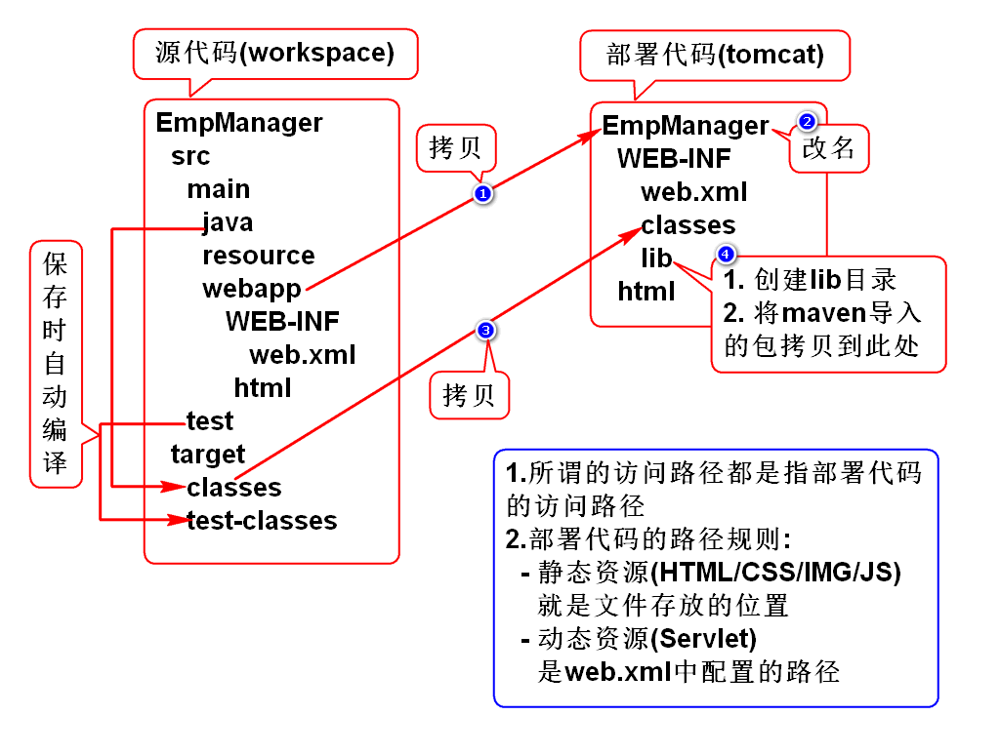

# Tomcat7目录说明
---

- bin  
	- 可执行二进制文件，可以启动关闭tomcat
##
- conf
	- 配置文件
		- server.xml:配置整个服务器的信息，如修改端口号，添加虚拟主机等
		- tomcatuser.xml:存储tomcat用户的文件，保存的是tomcat的用户名及密码，以及用户的角色信息
		- web.xml:部署描述文件，配置访问路径信息
		- context.xml:对所有应用统一配置，通常不去配置它
##		
- lib
	- tomcat的类库：所有的jar包
##
- logs
	- tomcat日志文件：tomcat的启动关闭信息
##	
- temp
	- 存放临时文件，tomcat停止后可以删除里面的文件
##	
- webapps
	- 存放web项目的目录，其中每个文件夹都是一个项目。root是一个特殊项目，在地址栏中没有给出项目目录时，对应的就是ROOT项目。http://localhost:8080/examples，进入示例项目。其中examples就是项目名，即文件夹的名字

##
- work
	- 运行时生成的文件，最终运行的文件都在这里。通过webapps中的项目生成的！可以把这个目录下的内容删除，再次运行时会生再次生成work目录。当客户端用户访问一个JSP文件时，Tomcat会通过JSP生成Java文件，然后再编译Java文件生成class文件，生成的java和class文件都会存放到这个目录下。

##
- LICENSE
	- 许可证

##
- NOTICE
	- 说明文件

---

